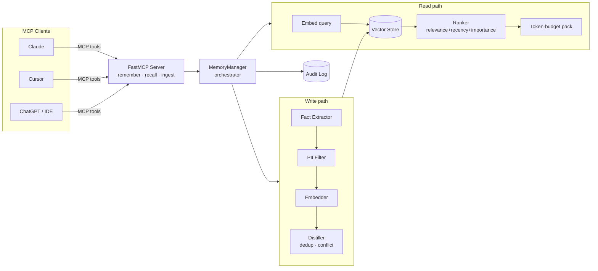

# MemMCP — Cross-Tool AI Memory Server

**A persistent, shared, _selective_ memory layer for LLM clients (Claude, Cursor,
ChatGPT, IDEs), built on the [Model Context Protocol](https://modelcontextprotocol.io).**

LLMs forget everything between sessions and across tools, so you keep
re-explaining your stack, your preferences, and your project. Pasting old chats
does not scale — it overflows the context window, replays your mistakes, leaks
secrets, and goes stale the moment a decision changes.

MemMCP is the **brain on top of storage**: it extracts durable facts from noisy
conversations, deduplicates them, resolves conflicts as beliefs change, and
surfaces only the handful of relevant facts for the current task — to every
connected tool, automatically.

> Storing text is the easy 10%. MemMCP does the hard 90%:
> **extract → dedupe → index → retrieve-the-right-bit → resolve conflicts → expire.**

---

## Why not just paste chats / read a file?

| Problem with paste / flat file | What MemMCP does |
| --- | --- |
| Doesn't scale — which of hundreds of chats has the context? | Semantic **retrieval** surfaces the relevant slice, not the whole history |
| Raw chat ≠ knowledge (dead ends, corrections) | **Fact extraction & distillation** into clean, self-contained facts |
| One flat file cross-contaminates projects/tools | **Project/tool scoping** with a readable-ancestor hierarchy |
| Contradictions pile up ("Postgres" then "MySQL") | **Conflict detection** supersedes stale beliefs by canonical key |
| Facts rot; nothing expires | **TTL / staleness** handling keeps memory current |
| Blind pastes leak secrets/PII | **PII-aware filtering** + append-only **audit log** |

---

## Architecture



Every box is a **pluggable interface** with an offline default, so the whole
system runs with zero configuration and zero API keys — then upgrades in place
when you install a backend.

| Layer | Offline default | Production upgrade |
| --- | --- | --- |
| Embeddings | `HashEmbedder` (deterministic) | `sentence-transformers`, OpenAI |
| Vector store | `NumpyVectorStore` (JSON persistence) | ChromaDB |
| Fact extraction | Rule-based patterns + taxonomy | OpenAI / Anthropic LLM |

---

## Quick start

```bash
# 1. Install (offline defaults only — lightweight)
pip install -r requirements.txt
pip install -e .          # put the `memmcp` package + console script on PATH

# 2. See the whole pipeline run end-to-end, no keys needed
python examples/demo.py

# 3. Run the tests
pytest -q
```

Optional upgrades:

```bash
pip install "chromadb"                # MEMMCP_VECTOR_BACKEND=chroma
pip install "sentence-transformers"   # MEMMCP_EMBEDDING_PROVIDER=sentence-transformers
pip install "openai"                  # MEMMCP_EMBEDDING_PROVIDER=openai / EXTRACTION_PROVIDER=openai
```

---

## Connect it to an MCP client

Run the server (stdio transport):

```bash
python -m memmcp.server
```

For **Claude Desktop**, copy the `memmcp` block from
[examples/claude_desktop_config.json](examples/claude_desktop_config.json) into
your `claude_desktop_config.json`, set the absolute paths, and restart Claude.
Cursor and other MCP clients use the same command/args/env shape.

---

## MCP tools exposed to the model

| Tool | Purpose |
| --- | --- |
| `remember` | Store one durable fact (with scope, importance, conflict key, TTL) |
| `ingest_conversation` | Distill a raw transcript into clean, deduplicated facts |
| `recall` | Retrieve the top relevant facts for a query, within a token budget |
| `list_memories` | List active (or superseded/expired) memories in a scope |
| `update_memory` | Edit a fact in place (re-embeds on content change) |
| `forget` | Delete a fact by id |
| `consolidate` | Merge near-duplicate facts in a scope |

Resources: `memmcp://stats` (memory + config) and `memmcp://audit` (recent events).

---

## The hard problems (and how they're solved)

- **Retrieval relevance** — cosine similarity blended with an exponential
  **recency** decay (half-life) and caller **importance**, then greedily packed
  into a token budget. See [ranker.py](src/memmcp/retrieval/ranker.py).
- **Fact extraction & distillation** — mine only user turns, normalise into
  self-contained facts, and assign a **conflict key** via a domain taxonomy. See
  [fact_extractor.py](src/memmcp/extraction/fact_extractor.py).
- **Conflict & staleness** — same-key facts with new values **supersede** old
  beliefs; TTLs expire facts automatically. See
  [distiller.py](src/memmcp/extraction/distiller.py).
- **Consolidation** — near-duplicate clusters are merged, keeping max importance.
- **Privacy/scoping** — regex + Luhn PII detection with block/redact/flag
  policies, hierarchical scopes, and an append-only audit trail. See
  [privacy/](src/memmcp/privacy) and [scoping.py](src/memmcp/scoping.py).

---

## Configuration

All settings have safe defaults; override via environment or `.env` (see
[.env.example](.env.example)). Highlights:

```ini
MEMMCP_EMBEDDING_PROVIDER=hash        # hash | sentence-transformers | openai
MEMMCP_VECTOR_BACKEND=numpy           # numpy | chroma
MEMMCP_EXTRACTION_PROVIDER=rule       # rule | openai | anthropic
MEMMCP_PII_POLICY=redact              # block | redact | flag | off
MEMMCP_WEIGHT_RELEVANCE=0.6           # ranking weights (auto-normalised)
MEMMCP_WEIGHT_RECENCY=0.25
MEMMCP_WEIGHT_IMPORTANCE=0.15
MEMMCP_RECENCY_HALFLIFE_DAYS=30
```

---

## Project layout

```
src/memmcp/
├── server.py            # MCP server (FastMCP) + tool definitions
├── memory_manager.py    # Orchestrator wiring the whole pipeline
├── config.py            # Env-driven settings
├── models.py            # Memory, ScoredMemory, result types
├── scoping.py           # Project/tool namespaces + hierarchy
├── embeddings/          # Pluggable embedders (hash / local / OpenAI)
├── store/               # Pluggable vector stores (numpy / Chroma)
├── retrieval/           # Ranking + token-budget packing
├── extraction/          # Fact extraction + distillation (dedup/conflict)
└── privacy/             # PII detection/redaction + audit log
tests/                   # Full pytest suite (offline)
examples/                # Runnable demo + Claude Desktop config
```

---

## Topics covered

Protocol (MCP tools/resources, client-server) · Information retrieval
(embeddings, vector search, hybrid ranking, RAG, context-window optimisation) ·
NLP (fact/entity extraction, distillation, dedup, conflict detection, PII) ·
Data (vector DBs, indexing, scoping, versioning, TTL/decay) · Systems (state,
caching, persistence) · Security (access scoping, PII governance, audit) · LLM
engineering (tool-calling design, token/cost optimisation).

## License

MIT
